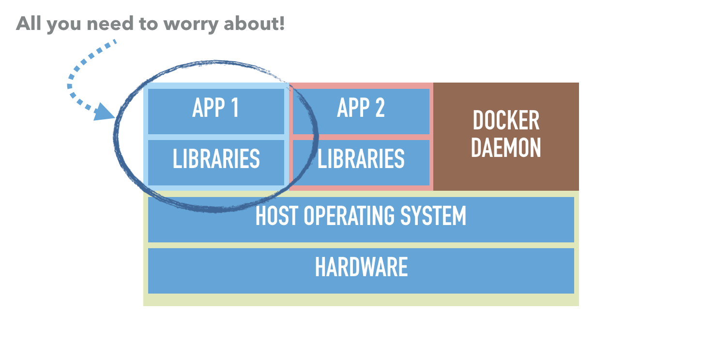
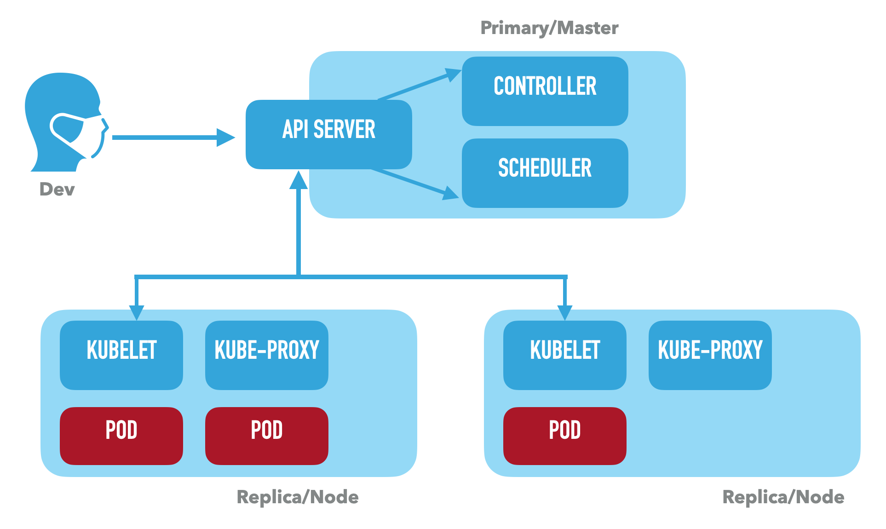
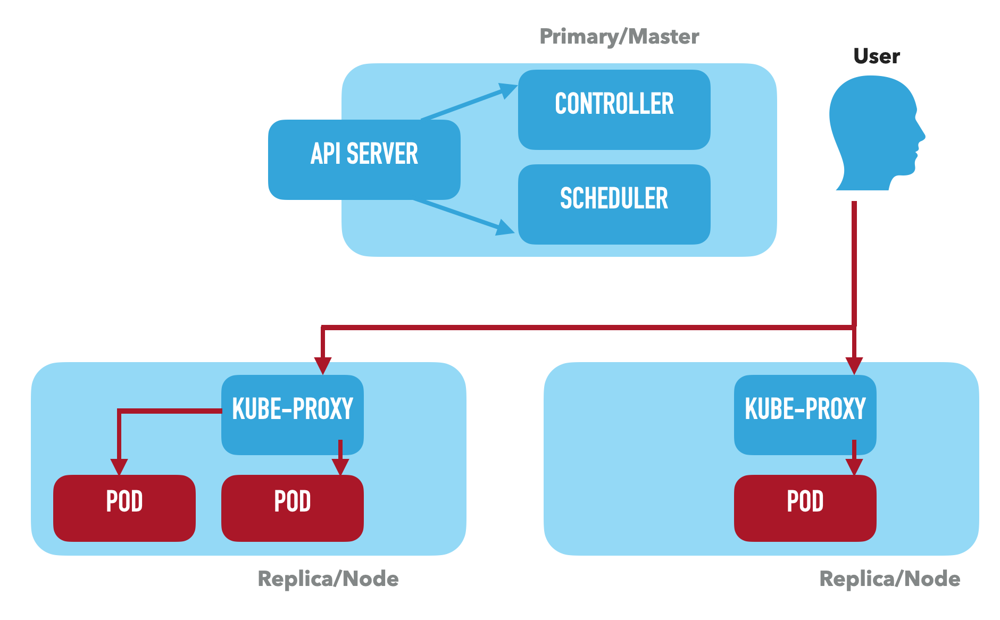

## Basic Concepts

So we just covered how Dockerizing applications gave us a couple of things:

 - **Portability**. A Dockerized application will now run the *exact same way* regardless of what the host operating system is, as long as it's a compatible Docker Host.

 - **Isolation**. With everything that you need encapsulated inside the image/container, this means that you no longer have to worry about dependencies being missing on your destination host.

Now, the mechanism by which things are packaged isn't the same as the mechanism by which they're deployed. If a Docker provides you with a way to make self-enclosed images, Kubernetes provides you with a way to make them available to the world.

Deploying things using Kubernetes basically means that you're giving Kubernetes instructions on where to get your app, and how you'll get it online. Kubernetes handles the rest.

*Kubernetes* is an open-source orchestration system for automating container deployment, scaling, and management. At its heart, it uses a *primary/replica architecture* - where the *primary* is the main controlling unit of the cluster, and the *replicas* are the units where the containers are deployed.

In the above example, the *primary* unit contains multiple services.

 - The **API server** is the interface for internal and external services. When we execute `kubectl` commands, this is what we're talking to.
 - The API server talks to the **Controller** which makes sure that what we *ask Kubernetes to deploy is there*. It makes sure that we have the right number of resources (pods, services, endpoints).
 - The API server also talks to a **Scheduler** - which selects where our containers run. It makes sure that the nodes that pods go to aren't overloaded!

We also have the replica, which is where our containers - effectively, *pods* go to.

 - The replicas run **kubelets** - which start and stop containers as directed by the control plane.
 - The replicas also run a **kube-proxy** - which directs traffic to our pods.

*...but what is a pod?*

### On Pods

And here comes the most difficult part of our workshop: defining pods.

**Pods** can be a single container, or a group of containers that are deployed on a host. Within a pod, all containers can talk to each other directly.

However, other pods cannot talk to the containers in another pod directly. If say, a container (*Container A.1*) which is in Pod A wants to talk to *Container B.1* in Pod B directly, it cannot do so - *Container A.1* can only talk to *Container B.1* if *Container B.1* is exposed by *Pod B*.

In general use however, companies generally like to use *one container per pod*. So we're going to use the terms *Pod* and *Container* interchangeably.

UP NEXT...

[Kubernetes Basics](5-Kubernetes-Basics.md)
